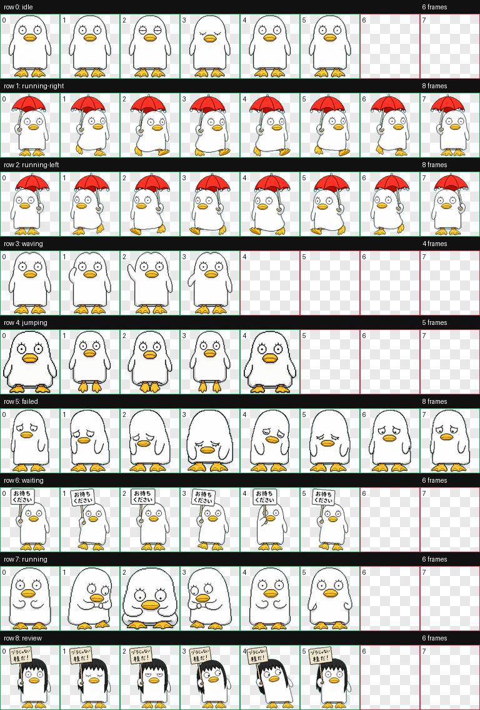

# Elizabeth Codex Pet

Elizabeth is a custom animated pet for the Codex desktop app, based on Elizabeth from *Gintama*.

This version includes classic Elizabeth moments:

- walking in the rain with a red umbrella
- holding a sign that says 「お待ちください」
- wigged Elizabeth holding the 「ヅラじゃない / 桂だ！」 sign



中文说明见 [README.zh-CN.md](README.zh-CN.md).

## Install

Clone this repository into your Codex pets folder:

```bash
git clone https://github.com/Ryan-Ren0330/elizabeth-codex-pet.git ~/.codex/pets/elizabeth
```

Then open Codex:

1. Go to **Settings > Appearance > Pets**.
2. Choose **Refresh custom pets**.
3. Select **Elizabeth**.
4. Run `/pet` or **Wake Pet** from the command menu.

## Files

- `pet.json` defines the Codex pet metadata.
- `spritesheet.webp` is the animated pet spritesheet.
- `preview/contact-sheet.png` shows the animation rows used by the app.

## License

MIT
