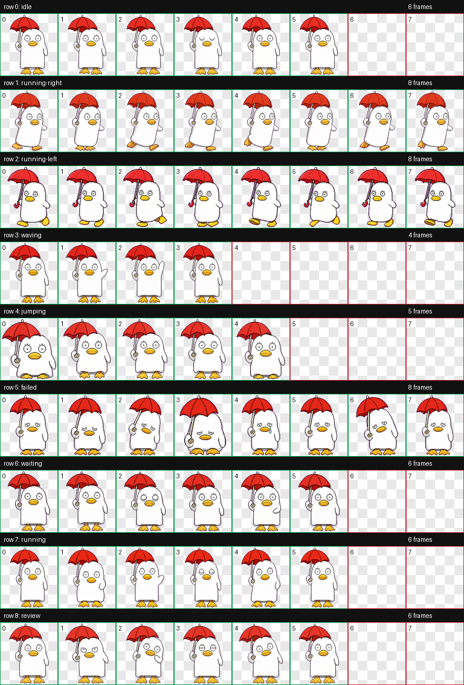
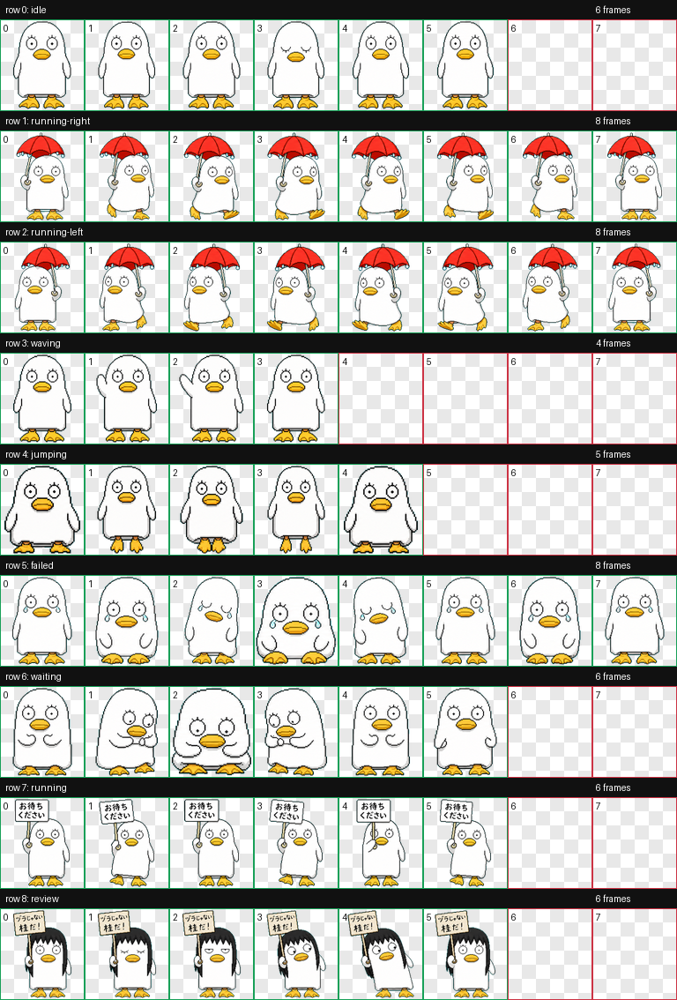

# Elizabeth Codex Pets

这是两套用于 Codex 桌面 App 的 Elizabeth 自定义动态宠物，形象基于《银魂》中的 Elizabeth。

## 可选版本

### Elizabeth

最早确认过的原版。



### Elizabeth Classic

第二套经典动作版，包含：

- 雨中撑红伞漫步
- 修正 idle 眼神，只保留圆眼帧和一次闭眼眨眼
- 正在处理任务时举牌写着「お待ちください」
- 等待状态使用小忙碌动作
- 修正挥手行头型，保持伊丽莎白圆顶头和圆眼
- 失败/哭泣状态只用圆眼或闭眼，眼旁加小泪珠
- 戴假发并举「ヅラじゃない / 桂だ！」牌子的造型



## 安装

先 clone 仓库，再把两套 pet 文件夹复制到 Codex 的自定义宠物目录：

```bash
git clone https://github.com/Ryan-Ren0330/elizabeth-codex-pet.git
mkdir -p ~/.codex/pets
cp -R elizabeth-codex-pet/pets/elizabeth ~/.codex/pets/
cp -R elizabeth-codex-pet/pets/elizabeth-classic ~/.codex/pets/
```

然后打开 Codex：

1. 进入 **Settings > Appearance > Pets**。
2. 点击 **Refresh custom pets**。
3. 选择 **Elizabeth** 或 **Elizabeth Classic**。
4. 在输入框运行 `/pet`，或者从命令菜单执行 **Wake Pet**。

## 文件说明

- `pets/elizabeth/` 是原版宠物包。
- `pets/elizabeth-classic/` 是第二套经典动作版宠物包。
- `preview/original/contact-sheet.png` 是原版动画预览图。
- `preview/classic/contact-sheet.png` 是经典动作版动画预览图。

## 许可协议

MIT
